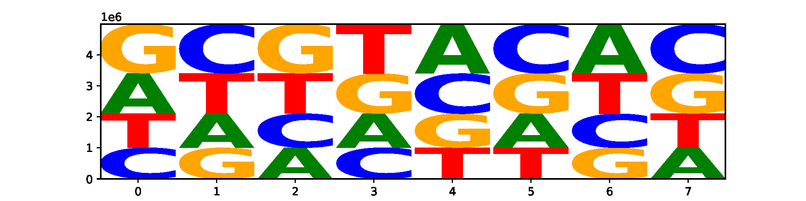
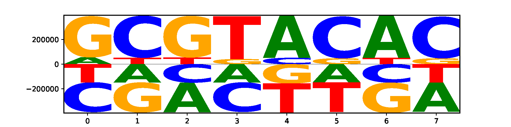
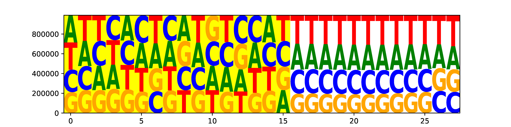
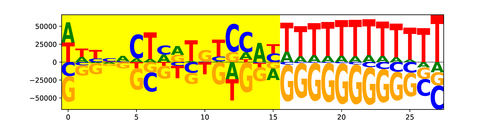

seq_logo.py
===================

Description
-------------
This program generates a DNA sequence logo from fasta or fastq format file.
It is useful to visualize the nucleotide compositions of sample barcodes,
cell barcodes and molecular barcodes (UMI).

Options
-------

  --version             show program's version number and exit
  -h, --help            show this help message and exit
  -i IN_FILE, --infile=IN_FILE
                        Input DNA sequence file in `FASTQ
                        <https://en.wikipedia.org/wiki/FASTQ_format#>`_, `FASTA
                        <https://en.wikipedia.org/wiki/FASTA_format>`_ or pure sequence format.
                        All sequences must be the same length. This file can be
                        plain text or compressed format (".gz",
                        ".Z",".z",".bz", ".bz2", ".bzip2").
  -o OUT_FILE, --outfile=OUT_FILE
                        The prefix of output files.
  --iformat=IN_FORMAT   The format of input file. Must be 'fq' or 'fa'.
                        defualt='fq'
  --oformat=OUT_FORMAT  The format of output logo file. Must be 'pdf', 'png'
                        or 'svg'. defualt='pdf'
  -n MAX_SEQ, --nseq-limit=MAX_SEQ
                        Only process this many sequences and stop.
                        default=none (generate logo fromALL sequences).
  --font-name=FONT_NAME
                        The font of logo characters. For a list of valid font
                        names, run logomaker.list_font_names().default='sans'
  --stack-order=STACK_ORDER
                        Must be 'big_on_top', 'small_on_top', or 'fixed'.
                        'big_on_top' : nucleotide with the highestfrequency
                        will be on the top; 'small_on_top' : nucleotide with
                        the lowest frequency will be on thetop; 'fixed' :
                        nucleotides from top to bottom are in the same order
                        as characters appear in thedata frame.
                        default='big_on_top'
  --flip-below          If set, characters below the X-axis (which correspond
                        to negative values in the matrix)will be flipped
                        upside down. default=False
  --shade-below=SHADE_BELOW
                        The amount of shading to use for characters drawn
                        below the X-axis. 0 <= shade_below <= 1.Larger values
                        correspond to more shading. default=0.0
  --fade-below=FADE_BELOW
                        The amount of fading to use for characters drawn below
                        the X-axis. 0 <= shade_below <= 1. Larger values
                        correspond to more fading. default=0.0
  --excludeN            If set, exclude all DNA sequences containing "N".
  --highlight-start=HI_START
                        Highlight logo from this position. Must be within [0,
                        sequence_length-1].default=none (no highlight)
  --highlight-end=HI_END
                        Highlight logo to this position. Must be within [0,
                        len(logo)-1].default=none (no highlight)
  --verbose             If set, print detailed information for debugging.

Input file format
------------------

FASTQ format

::

 @K00316:386:HHMKGBBXY:2:1101:28595:1314 1:N:0:NGTTTACT
 AGAGCCCTCTATTCGTATAAGTTTTCAT
 +
 AAFFFJJJJJJJJJJJJJJJJJJJJJJJ
 @K00316:386:HHMKGBBXY:2:1101:29021:1314 1:N:0:NGTTTACT
 CCGGTGATCTATGTGGATAGGTAATTGA
 +
 A<AFFF-F<J7<JAAJFA<FJFAFFJJ<
 @K00316:386:HHMKGBBXY:2:1101:29143:1314 1:N:0:NGTTTACT
 CTTCGGTGTCTTGCTCACGAACAGCTAT
 +
 AAFFFJJJJJJJJJJJJJJFJJJJJJJJ
 ...
 
FASTA format
::

 >seq_1
 AGAGCCCTCTATTCGTATAAGTTTTCAT
 >seq_2
 CCGGTGATCTATGTGGATAGGTAATTGA
 >seq_3
 CTTCGGTGTCTTGCTCACGAACAGCTAT
 ...
 
Sequence format
::

 AGAGCCCTCTATTCGTATAAGTTTTCAT
 CCGGTGATCTATGTGGATAGGTAATTGA
 CTTCGGTGTCTTGCTCACGAACAGCTAT
 ...
 
Example (Visualize sample barcode)
--------------------------------------
After ``cellranger mkfastq``, three fastq.gz files will be produced: I1, R1 and R2. 

- **I1 fastq file** contains the 8 bp **sample barcode**. **sample barcode** is used to separate reads into different samples.
- **R1 fastq file** contains the 16bp **cell barcode** + 10 bp UMI. **Cell barcode** is used to assign reads/UMIs to different cells. UMI is used to remove PCR duplicates. 
- **R2 fastq file** contains the real RNAseq reads. 

::

 #exclude barcode with "N"
 $python3 seq_logo.py -i ../normal_dat/indepth_C05_MissingLibrary_1_HL5G3BBXX/bamtofastq_S1_L003_I1_001.fastq.gz --excludeN -n 5000000 -o I1

 2020-09-29 01:54:41 [INFO]  Reading FASTQ file "../normal_dat/indepth_C05_MissingLibrary_1_HL5G3BBXX/bamtofastq_S1_L003_I1_001.fastq.gz" ...
 2020-09-29 01:55:12 [INFO]  5000000 sequences finished
 2020-09-29 01:55:12 [INFO]  Make data frame from dict of dict ...
 2020-09-29 01:55:12 [INFO]  Filling NA as zero ...
 2020-09-29 01:55:12 [INFO]  Making logo ...
 2020-09-29 01:55:12 [INFO]  'N' will be excluded.
 2020-09-29 01:55:12 [INFO]  Mean-centered logo saved to "I1.logo_mean_centered.pdf".
 2020-09-29 01:55:13 [INFO]  Logo saved to "I1.logo.pdf".

Three files were generated.

- I1.count_matrix.csv
- I1.logo.pdf
- I1logo.mean_centered.pdf

I1.logo.pdf

I1logo.mean_centered.pdf

Example (Visualize cell barcode and UMI)
----------------------------------------
Sequences in R1 fastq file contains cell barcode (first 16 nt) and UMI (last 10 nt)

::

 python3 seq_logo.py -i ../normal_dat/indepth_C05_MissingLibrary_1_HL5G3BBXX/bamtofastq_S1_L004_I1_001.fastq.gz --excludeN -n 5000000 --highlight-start 0 --highlight-end 15 -o R1
 2020-09-29 03:49:09 [INFO]  Reading FASTQ file "../normal_dat/indepth_C05_MissingLibrary_1_HL5G3BBXX/bamtofastq_S1_L004_R1_001.fastq.gz" ...
 2020-09-29 03:49:53 [INFO]  5000000 sequences finished
 2020-09-29 03:49:53 [INFO]  Make data frame from dict of dict ...
 2020-09-29 03:49:53 [INFO]  Filling NA as zero ...
 2020-09-29 03:49:53 [INFO]  Making logo ...
 2020-09-29 03:49:53 [INFO]  'N' will be excluded.
 2020-09-29 03:49:53 [INFO]  Mean-centered logo saved to "R1.logo_mean_centered.pdf".
 2020-09-29 03:49:55 [INFO]  Highlight logo from 0 to 15
 2020-09-29 03:49:55 [INFO]  Logo saved to "R1.logo.pdf".
 2020-09-29 03:49:56 [INFO]  Highlight logo from 0 to 15

**Output**

Three files were generated.

- R1.count_matrix.csv
- R1.logo.pdf
- R1logo.mean_centered.pdf

R1.logo.pdf (highlighted is the logo of cell barcode, un-highlighted is the logo of UMI)

R1.logo.mean_centered.pdf (highlighted is the logo of cell barcode, un-highlighted is the logo of UMI)

 