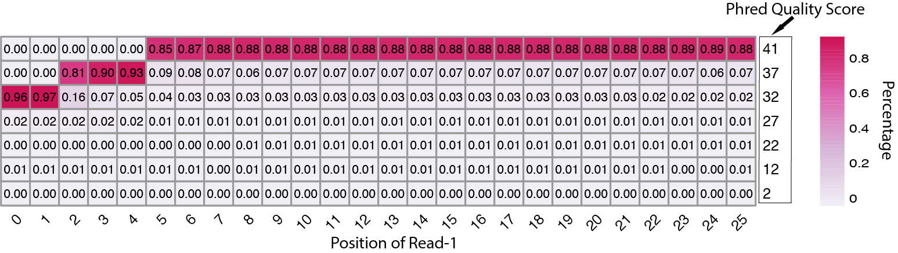

seq_qual.py
===========

Description
------------

This program generates heatmap from a FASTQ file to visualize the sequencing quality.

Options
-------

  --version             show program's version number and exit
  -h, --help            show this help message and exit
  -i IN_FILE, --infile=IN_FILE
                        Input file in FASTQ
                        (https://en.wikipedia.org/wiki/FASTQ_format#) format.
  -o OUT_FILE, --outfile=OUT_FILE
                        The prefix of output files.
  -n MAX_SEQ, --nseq-limit=MAX_SEQ
                        Only process this many sequences and stop.
                        default=none (generate logo from ALL sequences).
  --cell-width=CELL_WIDTH
                        Cell width (in points) of the heatmap. default=12
  --cell-height=CELL_HEIGHT
                        Cell height (in points) of the heatmap. default=10
  --font-size=FONT_SIZE
                        Font size in points. If --display-num was set,
                        fontsize_number = 0.8 * font_size. default=6
  --angle=COL_ANGLE     The angle (must be 0, 45, 90, 270, 315) of column text
                        lables under the heatmap. default=45
  --text-color=TEXT_COLOR
                        The color of numbers in each cell. default=black
  --file-type=FILE_TYPE
                        The file type of heatmap. Choose one of 'pdf', 'png',
                        'tiff', 'bmp', 'jpeg'. default=pdf
  --no-num              if set, will not print numerical values to cells.
                        default=False
  --verbose             If set, will produce detailed information for
                        debugging.                        

Example
-------

::
 
 
 $ python3 seq_qual.py -i  ../normal_dat/indepth_C05_MissingLibrary_1_HL5G3BBXX/bamtofastq_S1_L004_R1_001.fastq.gz -n  5000000 -o R1_qual
 
 2020-09-29 04:34:40 [INFO]  Reading FASTQ file "../normal_dat/indepth_C05_MissingLibrary_1_HL5G3BBXX/bamtofastq_S1_L004_R1_001.fastq.gz" ...
 2020-09-29 04:35:30 [INFO]  5000000 quality sequences finished
 2020-09-29 04:35:30 [INFO]  Make data frame from dict of dict ...
 2020-09-29 04:35:30 [INFO]  Filling NA as zero ...
 2020-09-29 04:35:30 [INFO]  Writing R code to "R1_qual.qual_heatmap.r"
 2020-09-29 04:35:30 [INFO]  Displayed numerical values on heatmap
 2020-09-29 04:35:30 [INFO]  Running R script file "R1_qual.qual_heatmap.r"
 Loading required package: Matrix
 Loading required package: SPAtest
 Loading required package: pheatmap

Output files
-------------

- R1_qual.qual_count.csv
- R1_qual.qual_heatmap.pdf
- R1_qual.qual_heatmap.r
- R1_qual.qual_percent.csv

R1_qual.qual_heatmap.pdf

